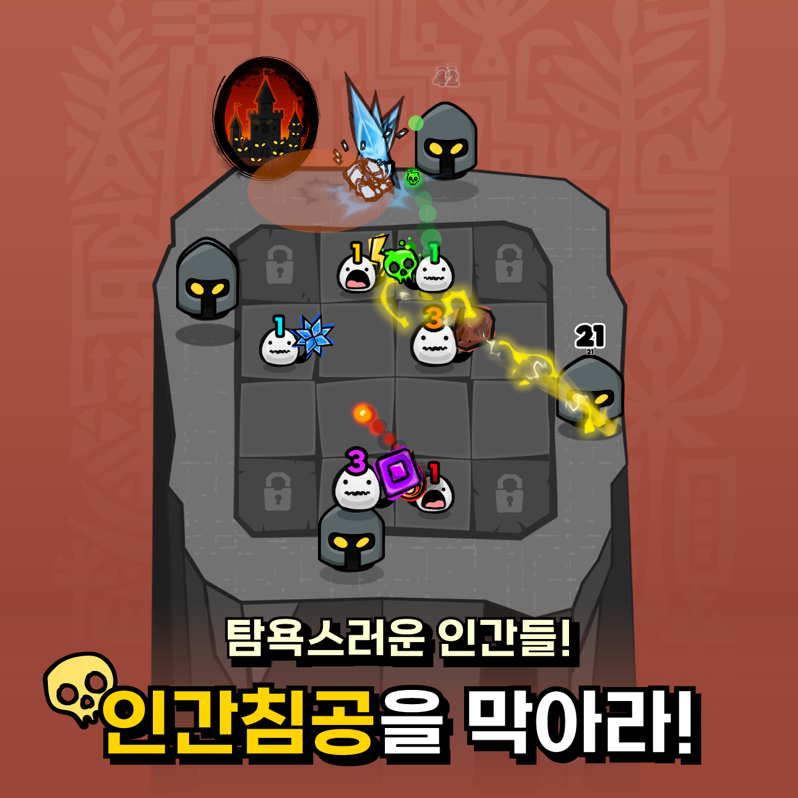
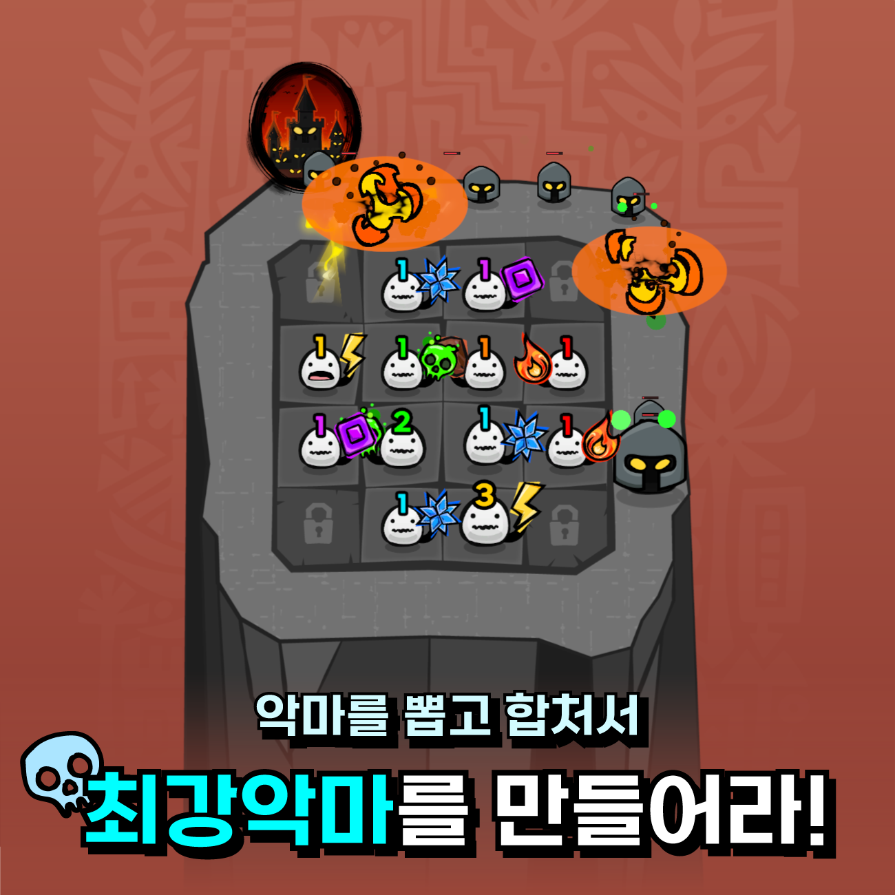

# Hell Keeper (지옥 좀 지켜주실래요)

A casual slot-defense mobile game I built solo and released on ONE Store, later ported to WebGL.

**Play it in the browser, no install: [developersayne.dev](https://developersayne.dev)**

> Selected C# source, published for portfolio review. Not a complete project, and it
> does not build as-is. Comments were translated to English.

  
  
  

Spin the slot to draw elemental heroes, then merge and upgrade them to hold the line against incoming waves.

## What is here

| | |
|---|---|
| [`SlotDefense/Combat/`](Assets/SlotDefense/Combat) | Hero attack loop and stat calculation, with three elemental implementations and the chain bolt one of them fires. |
| [`SlotDefense/Phases/`](Assets/SlotDefense/Phases) | Main, battle and result phases, and the machine that moves between them. |
| [`SlotDefense/Data/`](Assets/SlotDefense/Data) | Hero, augment and buff ScriptableObjects, and the manager that loads and serves them. |
| [`SlotDefense/Currencies/`](Assets/SlotDefense/Currencies) | Player currencies behind one owner: read-only reactive views out, validated writes in, persisted on every change. `Price` is the single place any cost is checked and paid. |
| [`SlotDefense/InGameUpgrades/`](Assets/SlotDefense/InGameUpgrades) | In-run upgrades where one reactive level drives price, damage multiplier and UI — derived values are never stored. |
| [`Framework/HeroDataPipeline/`](Assets/Framework/HeroDataPipeline) | Editor tool that turns the balance spreadsheet into typed C#, plus the runtime side that reads it. |
| [`Framework/RealTimer/`](Assets/Framework/RealTimer) | Wall-clock timer that keeps completing cycles while the app is closed. |

## Stack

Unity, C#, UniTask, UniRx, DOTween. Built for Android (ONE Store) and WebGL.

## Author

Jin Hyung Kang (Sayne) · [developersayne.dev](https://developersayne.dev) · sayneinteractive@gmail.com
